<div align="center">


<br/>

[](#-the-router-ollama-is-not-just-first-in-line)
[](#-tested-honestly)
[](#-tools-the-agent-can-call)
[](#-why-this-exists)
[](#-no-anthropic-api-anywhere-on-purpose)
[](#-docker--healthcheck)
[](#-connectivity-sse-websocket--cancellation)
[](#-why-this-exists)
[](#️-run_shell-is-real-heres-what-guards-it)
[](#️-endless-building-across-turns)
[](#-connectivity-sse-websocket--cancellation)
[](#️-two-front-ends-one-loop)


### 🐙 An **offline-first agentic coding agent**. Ollama runs the whole loop — Describe → Plan → Execute → Review — for free, with no login, no rate limit beyond your own hardware, and no Anthropic API anywhere in the codebase, on purpose.

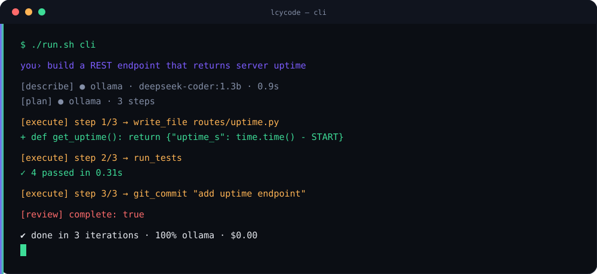


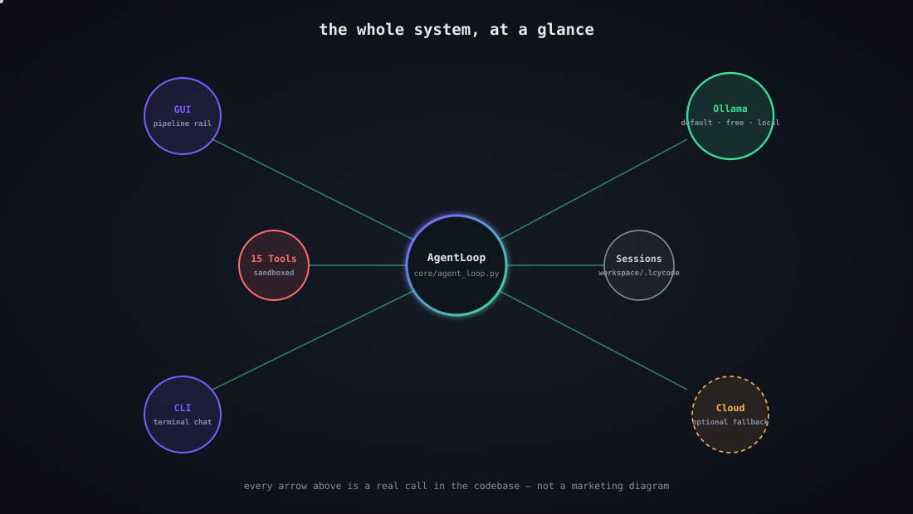


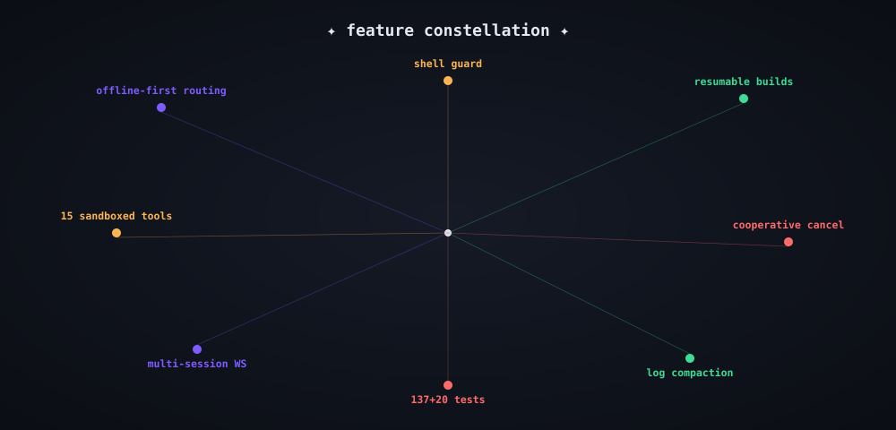

</div>

<br/>

## 📖 Table of contents

| 🧭 | 🧭 | 🧭 | 🧭 |
|---|---|---|---|
| [✨ Why this exists](#-why-this-exists) | [🚀 Quick start](#-quick-start) | [🧠 The agentic loop](#-the-agentic-loop) | [🏗️ Architecture](#️-architecture) |
| [🔀 The router](#-the-router-ollama-is-not-just-first-in-line) | [🔑 Key rotation & safety](#-key-rotation-cooldown--placeholder-filtering) | [🧰 Tools](#-tools-the-agent-can-call) | [♾️ Endless building](#️-endless-building-across-turns) |
| [🔌 Connectivity](#-connectivity-sse-websocket--cancellation) | [🌐 API surface](#-api-surface) | [🗜️ Compaction](#️-keeping-long-sessions-bounded) | [🛡️ Shell guard](#️-run_shell-is-real-heres-what-guards-it) |
| [🖥️ CLI & GUI](#️-two-front-ends-one-loop) | [✅ Tested, honestly](#-tested-honestly) | [🐳 Docker](#-docker--healthcheck) | [🤝 Claude Code + Ollama](#-bonus-run-the-real-claude-code-cli-against-ollama) |
| [⚙️ Config reference](#️-config-reference-keyjson) | [⚠️ Honest caveats](#️-honest-caveats--what-genuinely-isnt-verified-yet) | [🧪 Running it yourself](#-running-it-yourself) | [📂 Repo map](#-repo-map) |


## ✨ Why this exists

Most "agentic coding" tools assume a cloud API key, a login, and a
metered bill. 🙅 **LCYcode.ai flips the default.** Every stage of its
four-stage agent loop — Describe → Plan → Execute → Review — runs
against a local **Ollama** model unless you deliberately turn that off.
Cloud providers (OpenRouter, DeepSeek, Grok) exist purely as an
*optional*, *off-by-default* fallback for when Ollama is unreachable —
never as the primary path.

There is **no Anthropic API integration anywhere in this codebase**.
That's a deliberate design line, not a missing feature — see
[below](#-no-anthropic-api-anywhere-on-purpose) for the separate,
complementary way to point the *real* Claude Code CLI at the same local
Ollama setup, free.

<table>
<tr>
<td width="20%" align="center">🖥️<br/><b>Two front ends</b><br/><sub>Terminal-styled web GUI with a live pipeline rail + diff view, and a CLI — same agent loop underneath.</sub></td>
<td width="20%" align="center">🔁<br/><b>Resumable builds</b><br/><sub>Hits the iteration cap? It pauses and checkpoints — "Continue building" resumes exactly where it left off.</sub></td>
<td width="20%" align="center">🧰<br/><b>15 sandboxed tools</b><br/><sub>Filesystem, guarded shell, search, git, test/lint runners — all confined to <code>workspace/</code>.</sub></td>
<td width="20%" align="center">🧪<br/><b>157 tests</b><br/><sub>137 backend + 20 frontend, all passing, 20+ stress runs — and honest about what's mocked vs. verified live.</sub></td>
<td width="20%" align="center">💸<br/><b>$0.00</b><br/><sub>Ollama is free and unlimited by your own hardware. No account. No bill.</sub></td>
</tr>
</table>


## 🚀 Quick start

```bash
./setup.sh      # venv, deps, key.json bootstrap, ollama daemon check + model pull + live verify
./run.sh         # GUI at http://localhost:8420
./run.sh cli      # terminal chat instead
```

`setup.sh` copies `key.demo.json` → `key.json` on first run, starts the
Ollama daemon if it isn't already running, detects your RAM to pick an
appropriately-sized coding model, pulls it, and **verifies it actually
responds** with a real chat call before declaring success — not just
that the pull succeeded.


## 🧠 The agentic loop

<div align="center">
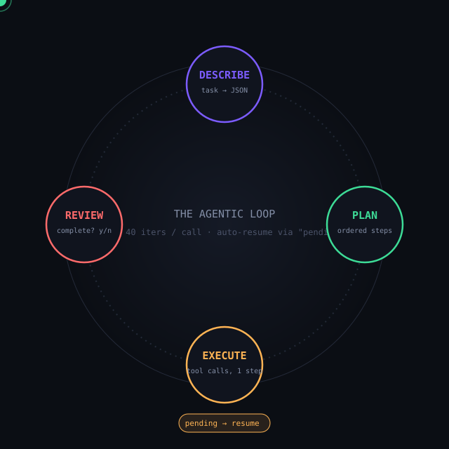
</div>

| Stage | Color | What happens |
|---|---|---|
| 🟣 **Describe** | violet | Restates the task as JSON: summary, goals, assumptions. |
| 🟢 **Plan** | mint | Breaks it into an ordered list of concrete steps. |
| 🟠 **Execute** | amber | Runs one step at a time. Prefers **native tool calling** (a real OpenAI-style `tool_call`, which Ollama, OpenRouter, DeepSeek, and Grok all support for tool-capable models); falls back to JSON-described tool calls for models that ignore the tool schema. |
| 🔴 **Review** | red | Checks the execution log against the plan, decides `complete: true/false`, can revise the remaining steps. |

Execute/Review repeat up to `routing.max_iterations` (**default 40**)
per call — a safety cap so a bad model/key combo can't loop forever.
`lcycode/core/prompts.py` holds the shared system prompt and the
JSON-mode + native-tool-mode helpers each stage builds on;
`lcycode/core/json_utils.py` does best-effort JSON extraction from raw
model output, since not every local model returns clean JSON even when
asked nicely.


## 🏗️ Architecture

<div align="center">
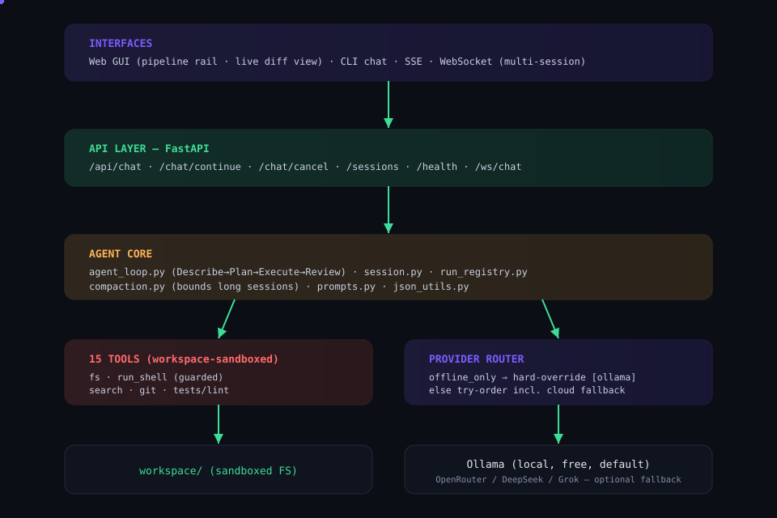
</div>

```
key.json / key.demo.json      your API keys + routing config (git-ignore key.json)
setup.sh / run.sh             automated setup + launcher
setup-claude-code.sh          optional: real Claude Code CLI ↔ Ollama
verify_live.py                real-model diagnostic (not mocked)
Dockerfile / docker-compose.yml

lcycode/
  config/
    settings.py                 shared paths
    key_manager.py               key rotation, cooldown-on-failure, offline_only enforcement,
                                    placeholder-key filtering (see 🔑 below)
    schema.py                    pydantic validation for key.json — fails fast on a typo instead
                                    of a confusing KeyError three stages into a run
    model_capabilities.py         known-model tool-calling registry — setup.sh checks your
                                    configured model against it and warns if it's known to handle
                                    native tool calls poorly; execute.py emits the same warning
                                    live if the JSON-fallback path actually triggers
  providers/
    base.py                      ProviderError, Completion (normalized content/tool_calls)
    retry.py                     async retry/backoff for transient HTTP failures
    ollama.py                    the core provider — reachability check, auto-pull, native tools
    openrouter.py / deepseek.py / grok.py    optional cloud fallbacks, same interface
    router.py                    tries providers in order, offline_only override, fallthrough
  core/
    agent_loop.py                 orchestrates the 4-stage loop; resumable execute/review cycle
    session.py                    persisted multi-turn session + "pending" state for resuming
    compaction.py                  keeps a long session's stored log/text bounded (see 🗜️ below)
    run_registry.py                tracks in-flight runs per session_id — how a cancel request
                                    from a different HTTP call (or WS frame) reaches a run
                                    already in progress
    prompts.py                    shared system prompt, JSON-mode + native-tool-mode stage helpers
    json_utils.py                 best-effort JSON extraction from model output
    logging_utils.py              shared logger → console + workspace/.lcycode/logs/
    stages/{describe,plan,execute,review}.py
  tools/
    filesystem.py                 write/read/edit/append/delete_file, list_dir
    shell.py                      run_shell (sandboxed, timeout, guarded — see shell_guard.py)
    shell_guard.py                  blocklist + resource limits for run_shell — see 🛡️ below
    search.py                     search_files (grep-like)
    git.py                        git_init/status/diff/commit/log
    quality.py                    run_tests / run_lint (auto-detects pytest/npm, ruff/eslint)
    registry.py                   dispatch table + OpenAI-style TOOL_SCHEMA for native tool calling
  api/
    server.py                     FastAPI app factory
    schemas.py                     pydantic request bodies (ChatRequest, ContinueRequest, CancelRequest)
    routes/{chat,status,workspace,session,sessions,health,ws}.py
  cli/{main,ui}.py                terminal chat, same agent loop as the GUI, Ctrl-C cancels cooperatively

frontend/                         chat GUI: pipeline rail, live coding view, continue-build bar, Stop button
                                     js/logic.js holds pure logic (diff, SSE parsing, stage mapping)
                                     separately from js/app.js's DOM code, specifically so it's
                                     testable — see tests/frontend/

tests/                            137 Python tests (key rotation, tools, sessions, offline enforcement,
                                     streaming, diffs, placeholder-key safety, cancellation, WebSocket
                                     multiplexing, run registry, session compaction, shell hardening)
                                     + tests/frontend/ — 20 Node tests for the pure GUI logic, zero
                                     npm dependencies
```


## 🔀 The router: Ollama is not just "first in line"

<div align="center">
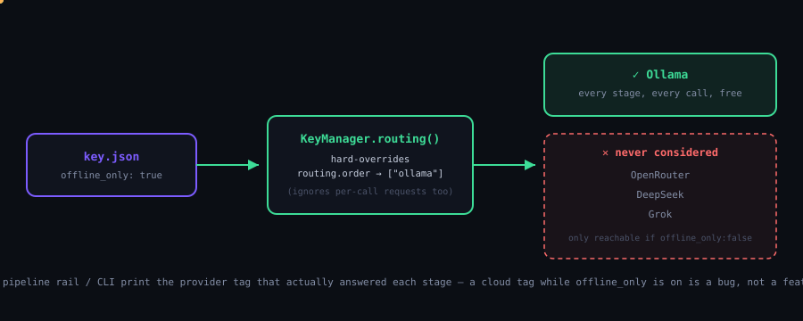
</div>

`key.json` ships with:

```json
"ollama": { "offline_only": true, "auto_pull": true }
```

This isn't just "Ollama first in a list that falls through to cloud on
failure." `offline_only: true` makes `KeyManager.routing()`
**hard-override** `routing.order` to `["ollama"]` — the router never even
*considers* OpenRouter / DeepSeek / Grok, regardless of what's
configured there or what any individual call requests. Every one of the
four stages goes through the exact same router, so Describe, Plan,
Execute, and Review are all Ollama calls, every time, unlimited, free.

Want cloud providers available as a fallback for when Ollama is
unreachable? Set `offline_only: false` — `routing.order` then decides
the try order (Ollama still first by default).

**You can see which provider actually answered each stage** — the
GUI's pipeline rail shows a small tag next to each stage (🟢 green =
ollama, 🟠 amber = a cloud provider) as soon as that stage's call
returns, and the CLI prints the same thing inline. This is
verification, not just a claim — if `offline_only` is on and a cloud
tag ever appears, that's a bug to report.

<div align="center">
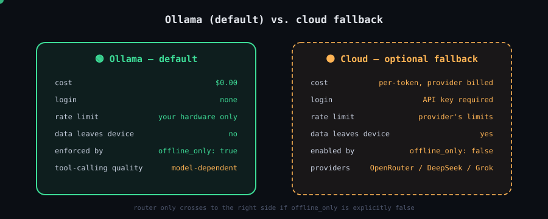
</div>

### 🚫 No Anthropic API anywhere, on purpose

This project has no Anthropic API integration, no Anthropic key field,
and no Anthropic login flow anywhere in its code — deliberately. If you
want the *real* Claude Code CLI working against the same local Ollama,
that's a separate, complementary path — see
[below](#-bonus-run-the-real-claude-code-cli-against-ollama).


## 🔑 Key rotation, cooldown & placeholder filtering

<div align="center">
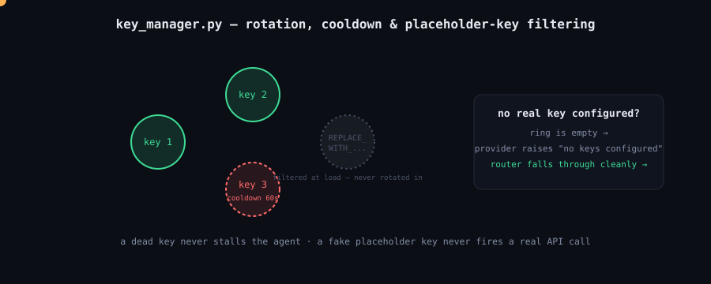
</div>

`lcycode/config/key_manager.py` loads `key.json` and rotates API keys
per provider. When a key fails (rate limit, auth error, timeout), it's
put on a **60-second cooldown** and the ring moves to the next key, so
one dead key never stalls the agent.

Placeholder keys — the `"REPLACE_WITH_..."` strings `key.demo.json`
ships with — are **filtered out at load time**, never rotated in. This
matters for the free-by-default guarantee: if `offline_only` ever gets
flipped to `false` without real cloud keys actually being added, the
ring for that provider is simply empty. `get_key()` returns `None`, the
provider raises `"no keys configured"`, and the router cleanly falls
through to the next one (Ollama, first by default) instead of firing an
API call with an obviously-fake key.

`lcycode/config/schema.py` validates the whole shape of `key.json`
against a pydantic model at startup — a typo or missing field fails
fast with a clear message instead of a confusing `KeyError` deep inside
a provider call three stages into a run.


## 🧰 Tools the agent can call

<div align="center">
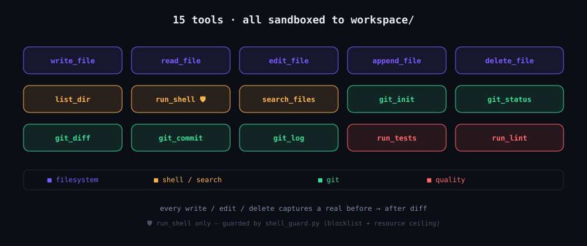
</div>

All 15 are confined to `workspace/` — paths cannot escape the sandbox.
`lcycode/tools/registry.py` holds the dispatch table plus the
OpenAI-style `TOOL_SCHEMA` used for native tool calling.

<table>
<tr><td valign="top">

**📁 Filesystem**
- `write_file`
- `read_file`
- `edit_file`
- `append_file`
- `delete_file`
- `list_dir`

</td><td valign="top">

**🖥️ Shell**
- `run_shell`
  <br/><sub>sandboxed, timeout, guarded — see [🛡️ shell_guard](#️-run_shell-is-real-heres-what-guards-it)</sub>

**🔍 Search**
- `search_files`
  <br/><sub>grep-like</sub>

</td><td valign="top">

**🌿 Git**
- `git_init`
- `git_status`
- `git_diff`
- `git_commit`
- `git_log`

</td><td valign="top">

**✅ Quality**
- `run_tests`
  <br/><sub>auto-detects pytest / npm</sub>
- `run_lint`
  <br/><sub>auto-detects ruff / eslint</sub>

</td></tr>
</table>

Every file-mutating call captures a **real before/after diff**, shown
live in the GUI's code view.


## ♾️ Endless building, across turns

If Review hasn't said `complete` when the iteration cap hits, the run
**pauses** instead of erroring: the plan and execution log are saved to
the session as `pending`. The GUI shows a **"Continue building"** bar;
the CLI accepts `continue`. Either resumes straight into Execute/Review
— no repeated Describe/Plan, no lost work — so one build can span as
many turns as it actually needs, up to `routing.max_total_iterations`
(default 1000).

> ✅ Verified end-to-end (not just unit-tested): a mocked run pauses at
> the cap, the session correctly persists the pending state,
> `/api/chat/continue` resumes and completes, and the iteration count
> carries over correctly across the resume.

### Sessions

`session_id` persists across `/api/chat` calls (stored under
`workspace/.lcycode/sessions/`). Each turn's summary feeds into the
next Describe stage for continuity within a session. The GUI keeps the
id in `localStorage`; "New session" clears it.

`GET /api/sessions` lists every known session with a summary (turn
count, last task, whether it's paused/resumable, whether it's
currently running) — discovery for a session you don't already have
the id for.

<div align="center">
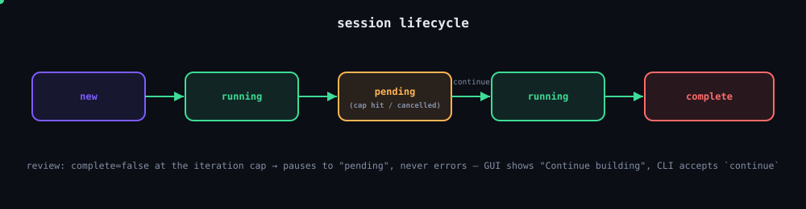
</div>


## 🔌 Connectivity: SSE, WebSocket & cancellation

The GUI talks to the backend over **SSE** (`POST /api/chat` /
`/api/chat/continue`, streamed response) — one request per turn,
simple, and what's tested most thoroughly here. A `POST /api/chat` call
runs `AgentLoop.run_to_completion()`, so unless you disable
`auto_continue`, one request can drive an entire multi-chunk build
without the client needing to do anything else.

**Stopping a run in progress:** `POST /api/chat/cancel {"session_id"}`
requests cancellation of whatever's running for that session.
Cancellation is *cooperative* — checked between stages and between
EXECUTE/REVIEW iterations, with an explicit `await asyncio.sleep(0)`
scheduler yield at each check — never mid-tool-call, so a command
already running finishes before the loop stops. A cancelled run
checkpoints to the session exactly like a paused one, so `continue`
picks it back up later. The GUI's Stop button and the CLI's Ctrl-C both
use this same mechanism.

> 🕐 **Honest note on responsiveness:** with a real Ollama model, each
> iteration involves real network I/O that naturally yields the event
> loop, so a cancel lands within a step or two in practice. Under a
> synthetic zero-latency benchmark (a test double that never actually
> awaits anything), a run whose tool calls complete near-instantly can
> keep re-queuing itself fast enough to noticeably delay a concurrent
> cancel request's turn — measured directly: cancellation still always
> lands, but took 24–28 iterations instead of the intended ~2 before
> the explicit yield was added, and roughly 11–14 after. Not a
> correctness gap — cooperative cancellation isn't meant to be instant
> — but "prompt" has a different meaning under real I/O than under a
> synthetic all-local benchmark.

<div align="center">
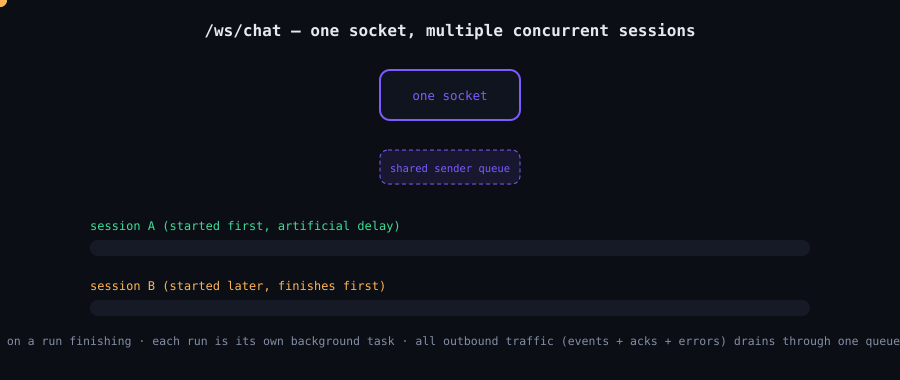
</div>

**`/ws/chat`** is a genuinely bidirectional alternative: one persistent
connection instead of one-request-per-turn, with `{"action":
"start"|"continue"|"cancel", ...}` JSON frames in both directions. The
reason this exists as a separate endpoint rather than just
documentation for `/api/chat/cancel`: over SSE, cancelling a run
requires a *second* HTTP request on a *different* connection, because
SSE is one-way. Over the WebSocket, a client can send `cancel` on the
same socket while events are still arriving.

**One connection can drive multiple concurrent runs** — one per
distinct `session_id`. Starting session B doesn't wait for session A to
finish on the same socket; only starting a second run for the *same*
session while one's already active gets rejected. Every event carries
`session_id` so a client watching several sessions on one connection
can route them. Getting this right server-side required three
genuinely concurrent pieces: a receiver loop that never blocks on a run
finishing (so a second `start` or a `cancel` is processed the instant
it arrives), each run as its own background task, and a single sender
loop draining one shared queue — routing *all* outbound traffic through
that one queue (not just agent events, but session acks and errors
too) was itself a fix: two different tasks calling `send_json`
independently is a real race on the same socket.
`tests/test_websocket.py` covers both the cancellation and the
multiplexing claim — including a test that proves session B provably
finishes before session A (started first, but with an artificial
delay) rather than asserting on event *order*, which is legitimately
nondeterministic between two truly concurrent tasks. Both the naive
single-run and the two-writer version failed real tests during
development before landing on this design.

**`GET /api/health`** reports whether Ollama is actually reachable and
whether anything's currently running — for a docker healthcheck, CI
smoke test, or monitoring, not used internally by anything else here.


## 🌐 API surface

| Route | Method | Purpose |
|---|---|---|
| `/api/chat` | `POST` | Start a new turn, SSE-streamed, runs to completion or pause |
| `/api/chat/continue` | `POST` | Resume a paused/pending run |
| `/api/chat/cancel` | `POST` | Cooperatively cancel a run in progress for a `session_id` |
| `/api/sessions` | `GET` | List every known session — turn count, last task, paused?, running? |
| `/api/session/{id}` | `GET` | Full detail for one session |
| `/api/workspace` | `GET` | Inspect files under `workspace/` |
| `/api/status` | `GET` | Current router/provider status |
| `/api/health` | `GET` | Ollama reachability + whether anything's running — used by the Docker healthcheck |
| `/ws/chat` | `WS` | Bidirectional, multi-session-capable version of the above |


## 🗜️ Keeping long sessions bounded

<div align="center">
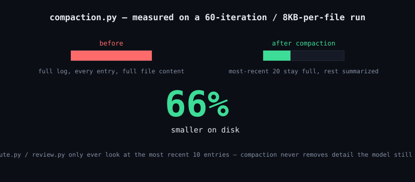
</div>

Turn count was already capped (`MAX_HISTORY_TURNS = 12`), but nothing
previously bounded how *long* any single turn's text could be, or how
large the execution log inside a paused/pending run could grow — and
with `auto_continue` chaining up to `max_total_iterations` (1000 by
default), a long build's log can accumulate a lot of entries, each
duplicating a written file's full content in both the tool call's
`args` and its diff `result`.

`lcycode/core/compaction.py` bounds both: turn summaries and task text
get truncated to ~240 characters before being stored, and a pending
run's log has anything older than its most recent 20 entries reduced to
a lightweight summary (tool, path, ok/error — no file content) the
moment it's persisted. The most recent 20 entries always stay full,
which matters because that's more than the 10-entry window
`execute.py`/`review.py` actually look at when deciding the next tool
call — compaction never removes detail the model still needs, only
detail that's purely historical at that point.


## 🛡️ `run_shell` is real — here's what guards it

`run_shell` executes real commands inside `workspace/` with no network
sandboxing beyond the OS itself — treat it like giving the model a
terminal, because that's what it is. It runs in a thread via
`asyncio.to_thread`, so a slow command doesn't freeze the whole server
— but it's still a real shell with real access.

`lcycode/tools/shell_guard.py` blocks a list of obviously destructive
patterns — escaping the workspace via `cd /`, `rm -rf ~`, `sudo`, fork
bombs, disk-device writes, `curl | bash` — and applies a best-effort
memory/CPU ceiling before anything runs.

> ✅ Verified end-to-end that a blocked command genuinely never executes
> (a canary file survives a real `rm -rf ~` attempt routed through the
> actual agent loop, not just a unit test of the guard function). **Read
> the module's own docstring before trusting this more than it claims**
> — a regex blocklist can always be evaded by a deliberately adversarial
> input. It exists for the realistic failure mode — a model losing
> context over a long chain and emitting something destructive it
> didn't "mean" to — not as a substitute for running this in a
> container if you're ever feeding it genuinely untrusted input.


## 🖥️ Two front ends, one loop

- **GUI** (`frontend/`) — chat column, live pipeline rail (shows which
  stage is active and which provider answered it), a live diff/code
  view, a "Continue building" bar for paused runs, and a Stop button.
  `js/logic.js` holds the pure logic (diff computation, SSE parsing,
  stage mapping) deliberately separate from `js/app.js`'s DOM code, so
  the logic is unit-testable without a browser — see `tests/frontend/`.
- **CLI** (`lcycode/cli/main.py`, `ui.py`) — the same `AgentLoop`
  underneath, terminal chat with inline stage/provider printouts,
  `continue` to resume a paused build, Ctrl-C to cancel cooperatively.

Both are thin shells around the exact same `lcycode/core/agent_loop.py`
— nothing about the agent's behavior differs between them.


## ✅ Tested, honestly

<div align="center">
</div>

Every test here runs against **mocked providers** — fake `call_llm`
functions returning canned `Completion` objects, not a real model.
That's the right tool for testing this project's own orchestration
logic (the loop, cancellation, sessions, diffing, the guard, the
WebSocket concurrency) and it's been enough to catch real bugs: a
word-boundary regex mistake in the shell guard, a genuine race
condition in the first WebSocket implementation, `run_shell` blocking
the entire event loop via a synchronous subprocess call. All caught by
tests, not by inspection, and all fixed with the fix itself verified by
a follow-up test or a live end-to-end proof.

```bash
source .venv/bin/activate && pytest              # 137 backend tests
node --test tests/frontend/logic.test.js          # 20 frontend logic tests, no npm install needed
```

### Verifying against a real Ollama (not mocked)

```bash
source .venv/bin/activate
python3 verify_live.py
python3 verify_live.py --model qwen2.5-coder:7b
python3 verify_live.py --task "write a python fizzbuzz script to fizzbuzz.py"
python3 verify_live.py --full
```

Every test above runs against a fake `call_llm` — appropriate for
testing this project's own logic, but it can't tell you anything about
how your actual model behaves. `verify_live.py` runs one real task
through the real agent loop against your real Ollama daemon and
reports, per stage: response latency, whether the model used native
tool calling or fell back to the slower JSON-described path (the
single most useful signal for judging whether your model is a good fit
for this), and the actual file(s) it wrote. Exit code 0 on completion,
1 otherwise — safe to use in a shell conditional.

`--full` runs three scenarios back to back — a simple file write, a
task that requires `run_shell` (proving `shell_guard.py` behaves
correctly against a real run, not just its mocked tests), and a
multi-file task that exercises PLAN/REVIEW across several iterations —
then prints a summary with an overall native-tool-calling rate across
all of them.


## 🐳 Docker & healthcheck

<div align="center">
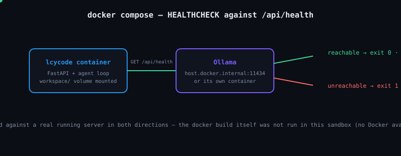
</div>

```bash
docker compose up --build
```

Mounts `key.json` read-only and `workspace/` as a volume. Point
`ollama.host` at `http://host.docker.internal:11434` in `key.json` if
Ollama runs on the host rather than in its own container.

Both the `Dockerfile` and `docker-compose.yml` define a `HEALTHCHECK`
against `/api/health` — `docker compose ps` shows "unhealthy" if Ollama
isn't reachable, not just if the process crashed.

> Verified the exact healthcheck command against a real running server
> in both directions (Ollama reachable → exit 0, unreachable → exit 1)
> — but building and running the actual container wasn't something
> possible in the sandbox this was built in (no Docker available
> there), so the image build itself hasn't been end-to-end tested, only
> the pieces that make it up.


## 🤝 Bonus: run the real Claude Code CLI against Ollama

Since Ollama v0.14.0, it exposes an Anthropic Messages API-compatible
endpoint, and Claude Code (Anthropic's own CLI) respects the
`ANTHROPIC_BASE_URL` env var to redirect away from `api.anthropic.com`
— both officially documented, not a workaround. Together, that means
the *actual* Claude Code CLI can run against a local Ollama model,
free, with no Anthropic account, login, or API key.

```bash
./setup-claude-code.sh      # installs the real claude CLI, wires it to
                              # this project's already-configured ollama host
./run-claude-code.sh         # launches it with key.json's default model
./run-claude-code.sh qwen2.5-coder:7b   # or any other pulled model
```

**This is separate from LCYcode.ai's own agent loop** (`main.py`) —
that stays exactly as documented above, its own Describe/Plan/Execute/
Review loop with its own tools and GUI. This is a second, independent
option in the same project directory. Use LCYcode.ai's GUI/CLI when you
want the browser view, resumable sessions, live diffs, and
multi-provider routing built in this project. Use real Claude Code (via
this script) when you want its more complete, more mature agentic
feature set — subagents, its own web search/fetch tools, `/loop`
scheduled tasks — and don't need this project's extras. Both point at
the same local model if you want.

> Same caveat as everywhere else in this project: tool-calling quality
> depends on the model. `deepseek-coder:1.3b` (the default) will work
> but falls back to weaker behavior more often than a tool-tuned model
> like `qwen3-coder` or `qwen2.5-coder:7b`. Separately, and worth
> knowing regardless of which model you pick: Ollama's own docs
> recommend at least 32K tokens of context length for Claude Code to
> work well — a model running at a small default context window will
> truncate the conversation, which can look like a model-quality
> problem when it's actually a context-window one. Check with `ollama
> show <model>`.


## ⚙️ Config reference (`key.json`)

```json
{
  "openrouter": { "keys": [], "models": [] },
  "grok":       { "keys": [], "model": null },
  "deepseek":   { "keys": [], "model": null },
  "ollama": {
    "host": "http://127.0.0.1:11434",
    "model": "deepseek-coder:1.3b",
    "enabled": true,
    "offline_only": false,
    "auto_pull": true
  },
  "routing": {
    "order": ["ollama", "openrouter", "deepseek", "grok"],
    "max_iterations": 40,
    "tool_timeout_seconds": 60,
    "auto_continue": true,
    "max_total_iterations": 1000
  }
}
```

Validated against a pydantic schema (`lcycode/config/schema.py`) at
startup — a typo fails fast with a readable error instead of a
confusing runtime `KeyError`. `key.demo.json` ships with
`"REPLACE_WITH_..."` placeholder strings for every cloud key, which
`key_manager.py` filters out at load time so they can never
accidentally reach a real endpoint.


## ⚠️ Honest caveats / what genuinely isn't verified yet

This project tries hard not to overclaim — see
[`PROJECT_STATUS.md`](./PROJECT_STATUS.md) for the single-page snapshot
this README is distilled from.

- **Ollama's tool-calling support varies by model.** Not every local
  model handles the `tools` schema well; the JSON-mode fallback in the
  EXECUTE stage exists specifically for that case. Models built for
  tool use (e.g. recent Qwen2.5-Coder, Llama 3.1 tool-tuned variants) do
  noticeably better here than very small general models.
- **This has never been run against a real live Ollama daemon or a
  real OpenRouter/DeepSeek/Grok API key.** Every test in this project —
  all 137 backend + 20 frontend tests, and every end-to-end proof
  described throughout this README — runs against mocked providers
  (`Completion` objects returned by a fake `call_llm`), not a real
  model. That's deliberate and appropriate for testing the
  orchestration logic (the loop, cancellation, sessions, diffing, the
  guard), but it means real model behavior — actual tool-calling
  reliability, actual response quality, actual latency — is genuinely
  unverified from this side. **Run `python3 verify_live.py`** for that
  missing piece.
- **Docker hasn't been build-tested.** No Docker available in the
  sandbox this was built in — `Dockerfile`/`docker-compose.yml` are
  reviewed for correct syntax and the healthcheck command is verified
  against a real running server, but the actual `docker build` /
  `docker compose up` path has not been run end-to-end.
- **`run_shell` executes real commands** inside `workspace/` with no
  network sandboxing beyond the OS itself — see
  [🛡️ shell guard](#️-run_shell-is-real-heres-what-guards-it) above for
  exactly what is and isn't covered.


## 🧪 Running it yourself

```bash
git clone https://github.com/lawcy0fficial/LCYcode.ai.git
cd LCYcode.ai
./setup.sh
./run.sh              # GUI  → http://localhost:8420
./run.sh cli            # CLI chat
```

## 📂 Repo map

```
LCYcode.ai/
├── main.py                     entry point
├── setup.sh / run.sh            bootstrap + launcher
├── setup-claude-code.sh         optional: real Claude Code CLI ↔ Ollama
├── verify_live.py               real-model diagnostic (not mocked)
├── key.demo.json → key.json     routing + provider config
├── docker-compose.yml / Dockerfile
├── lcycode/                     the agent — config, providers, core, tools, api, cli
├── frontend/                    the GUI (vanilla JS, no framework)
├── tests/                       137 backend + 20 frontend tests
├── documents/                   this README's SVG graphics, diagrams & animations
├── PROJECT_STATUS.md            single-page honest snapshot
└── workspace/                   sandbox root — everything the agent writes lives here
```

<br/>

<div align="center">


<sub>Built to be picked up cold — if something above is wrong or has
drifted from the code, trust the tests and <a href="./PROJECT_STATUS.md">PROJECT_STATUS.md</a> over the prose.</sub>

<br/><br/>


<br/>


<br/><br/>

[](#-the-router-ollama-is-not-just-first-in-line)
[](#-why-this-exists)
[](#-tools-the-agent-can-call)
[](#-tested-honestly)

<sub>⭐ if this was useful — issues and PRs welcome</sub>

</div>
